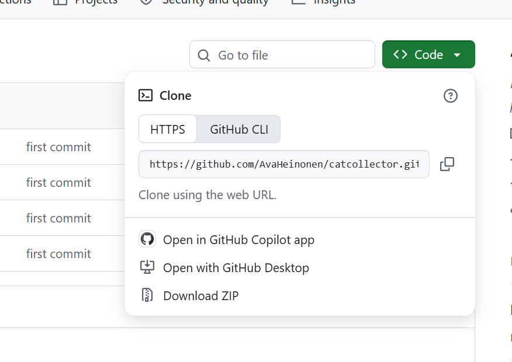
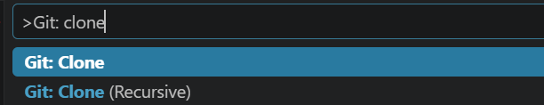
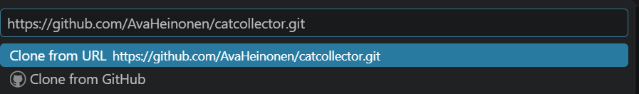

## Cloning instructions
1. Copy the URL of the repository by clicking the green <> code button, and copying the URL from the popup window that opens (see screenshot below)

2. In Visual Studio Code, open the command palette by pressing Ctrl+Shift+P (Windows) or Cmd+Shift+P on Mac (Mac).

3. Type Git: clone into the command palette, and select it from the list (see screenshot below)

4. Paste the repository url to the text box and press "Enter" (see screenshot below)

5. A File browser should open. Select the directory where the repository should be cloned to. 
Note, that this is a new repository. To prevent git issues select a directory that **is not** the same as where your exercises and project are. 

6. Open the new repository in visual studio code

## Setup in VS code
To run the notebook in vscode, you will need to:
1. install the Jupyter extension
2. Select your python kernel 

### Install Jupyter extension
To install the jupyter extension:
1. Open the extension panel by clicking the button that has four squares on the lefthand panel 
2. search for jupyter, and select the extension that is called just Jupyter (not one of the extras like Jupyter Keymap. Just Jupyter)
3. Install the extension by clicking install and waiting for VS code to complete the process

### Select your python kernel
Open one of the notebooks.
Visual Studio should prompt you to install the required kernel. 
If it does not do so automatically, try running one of the code cells.

Follow the visual studio code instructions to install the kernel. 

